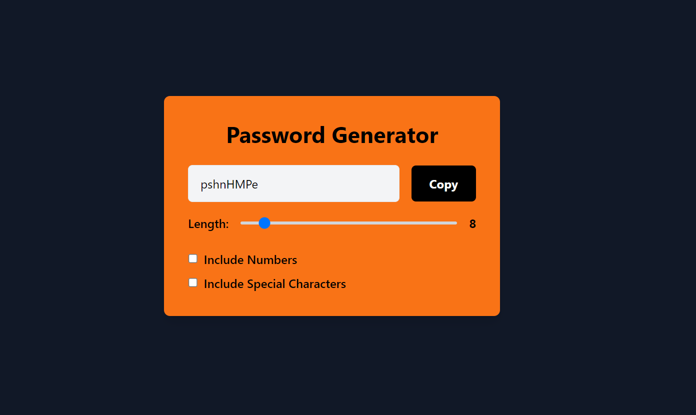

# Password Generator React App

This is a simple Password Generator app built using React, Tailwind CSS, HTML, and JavaScript. It allows users to generate random passwords with customizable length, including options for including numbers and special characters.

## Features

- **Random Passwords**: Generates random passwords based on user preferences.
- **Length Slider**: Allows users to select password length using a slider.
- **Include Numbers**: Option to include numbers in the generated password.
- **Include Special Characters**: Option to include special characters in the generated password.

## Technologies Used

- React: A JavaScript library for building user interfaces.
- Tailwind CSS: A utility-first CSS framework for styling web applications.
- HTML: Markup language for creating web pages.
- JavaScript: Programming language for adding interactivity to web pages.

## Getting Started

To run this project locally, follow these steps:

1. Clone this repository to your local machine.
2. Navigate to the project directory in your terminal.
3. Run `npm install` to install project dependencies.
4. Run `npm run dev` to start the development server.

## Usage

1. Choose the desired password length using the slider.
2. Check the "Include Numbers" checkbox if you want numbers in the password.
3. Check the "Include Special Characters" checkbox if you want special characters in the password.
4. Click the "Generate Password" button to generate a random password based on your selections.
5. Copy the generated password to use it for your accounts.

## Screenshots

## Contributing

Contributions are welcome! Fork the repository and submit a pull request to suggest improvements.
